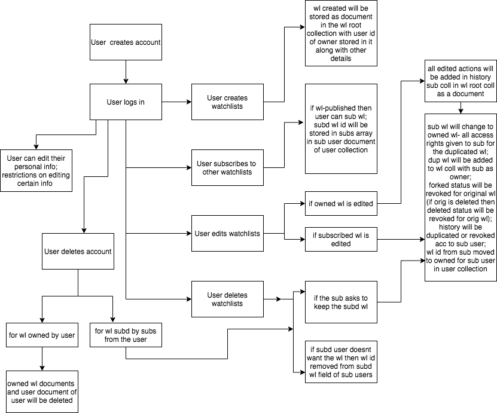



DbdesignforStreetCred

TherearetwocollectionsnamelyUsersandWatchlists.

UndertheUserscollection,inasingleUserIddocumenttherearecommonfields:

birth\_year (number)

name (map)

● first\_name (string)

● last\_name (string)

watchlists (map)

● owned (array)

➤ 0 (string)

● subscribed (array)

➤ 0 (string)

andanother\_user\_infosubcollectioninwhichasingledocumentscontainsthefollowingfields

address (map)

● city (string)

● country (string)

● street (string)

● zipcode (number)

annual\_income (string)

citizenship\_status (string)

country\_of\_birth (string)

dob (string)

email\_id (string)

employer\_info (map)

● employer\_address (string)

● employer\_name (string)

● job\_title (string)

employment\_status (string)

funding (string)

investible\_or\_liquid\_assets (string)

net\_worth (string)

phone\_number (number)

visa\_details (map)

● country\_of\_citizenship (string)

● expiration\_date (string)

● visa\_type (string)

UndertheWatchlistscollection,inasingleWatchlistIddocumenttherearecommon

fields:

isDefault (boolean)

isDeleted (boolean)

isForked (boolean)

isPublished (boolean)

name (string)

stocks\_list (map)

● 0 (string)

● 1 (string)

● 2 (string)

user\_id (string)

andasubcollectioncalledhistorywhichincludesthehistoryofactionsmadebytheownero f

watchlists.

Thehistorysubcollectioncontainsthefollowing:

data (array)

● 0 (map)

➤ action (string)

➤ date/time (timestamp)

➤ description (array)

■ 0 (map)

➤ name (string)

➤ price (number)

Standardcases

● Userlogsin

● Userscancreate,update,delete,andreadtheirownedwatchlists

● Subscriberscaneitheronlyreadthesubwatchlistoriftheyeditthewatchlistthenthesaid

watchlistwillbechangedfromsubscribedwatchlisttoownedwatchlist.

● Userscanshareownedwatchlistswithotherusers.

● Watchlistshaveahistoryfeaturewhichshowstheactionsrelatedtowatchlistmadebythe

owner.

EdgeCases

● Whentheuserdeletesownedwatchlistbutthesubscriberisstillsubscribedandiswatching

thesamewatchlist.

● Whentheuserupdatesownedwatchlistwhilethesubscriberisreadingitatthesametime.

● Ifthewatchlistsshouldbedownloadableoravailableoffline.

● Iftheuseraddsthewatchlistwhilethestockdetailsarebeingupdated.

● Iftheuserdeletestheiraccountthenthewatchlistssubscribedfromthatusermustbeeither

deletedorchangedfromsubscribedtoownedforthesubscribersofthatuser.

● Amountofwatchliststobeshown.

● Timezoneanddaylightsaving.

RiskMitigation

● Usersmustnotbeallowedtoupdateanythingrelatedtopayment.

● Usersmustnotbeallowedtomanipulatethenumberofforks,watchlistsandsubscribers.

● Usersmustnotbeunsubscribedbeforeconfirmingsoafterclickingonunsubscribebutton.

● Subscribersmustnotbeabletoreadwatchlistsnotsubscribedorownedbythemselves.

